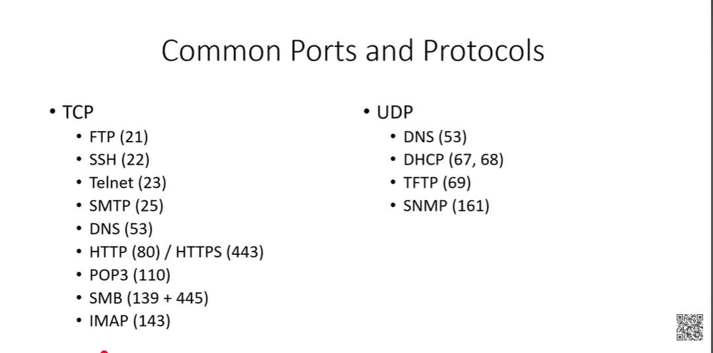

# Common Ports & Protocols

## TCP-based
| Port | Protocol | Notes |
|---|---|---|
| 21 | FTP | File Transfer Protocol |
| 22 | SSH | Encrypted remote access |
| 23 | Telnet | Cleartext remote access — insecure, avoid in modern use |
| 25 | SMTP | Sending mail |
| 80 | HTTP | Web traffic (unencrypted) |
| 110 | POP3 | Retrieving mail |
| 139 | SMB (NetBIOS) | Legacy file sharing over NetBIOS |
| 143 | IMAP | Retrieving mail (syncs across devices, unlike POP3) |
| 443 | HTTPS | Web traffic (encrypted) |
| 445 | SMB | Modern direct file sharing (no NetBIOS needed) |

**SSH vs Telnet:** SSH encrypts traffic; Telnet sends everything in cleartext — including credentials. Telnet is a known easy win in pentests if still found in use.

**SMB detail:** Server Message Block primarily uses **TCP 445** for modern direct communication and **TCP 139** for legacy NetBIOS-based connections, alongside **UDP 137/138** for name resolution services. SMB is a very common attack surface in internal pentests (e.g. EternalBlue exploited SMB).

**DNS** — Domain Name System — resolves human-readable domain names to IP addresses. Runs over both UDP and TCP port 53 (UDP for standard lookups, TCP for zone transfers/larger responses).

## UDP-based
| Port | Protocol | Notes |
|---|---|---|
| 67/68 | DHCP | Dynamically assigns IP addresses to devices; can also assign static IPs based on MAC address (reservation) |
| 69 | TFTP | Trivial File Transfer Protocol — simplified FTP, no authentication, often used for network device configs |
| 161 | SNMP | Simple Network Management Protocol — used to monitor/manage network devices; older versions (v1/v2c) send community strings in cleartext — a classic pentest finding |

## Why Ports Matter for Pentesting
Port scanning (nmap etc.) is often the first real recon step in an engagement — open ports reveal what services are running, which maps directly to what attack surface exists. Memorizing these isn't about trivia; it's about recognizing at a glance what a scan result implies.