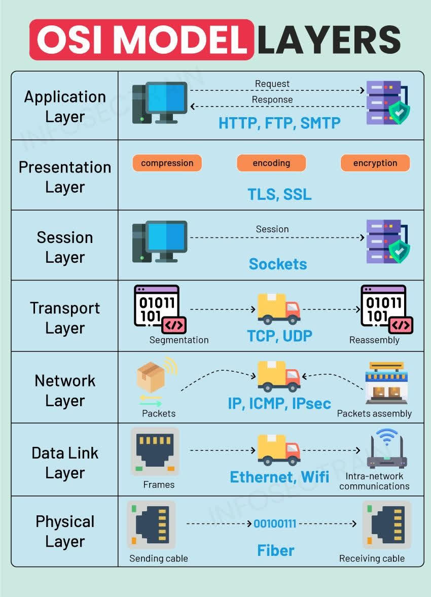
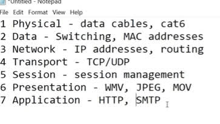

# OSI Model

The OSI (Open Systems Interconnection) model breaks network communication into 7 layers. Each layer has a specific job, and data gets encapsulated as it moves down the stack (sender) and de-encapsulated moving up (receiver).

## Reference Images

| Layer | Name | Function | Example |
|---|---|---|---|
| 7 | Application | User-facing services | HTTP, FTP, DNS |
| 6 | Presentation | Data formatting/encryption | SSL/TLS, JPEG |
| 5 | Session | Manages sessions/connections | NetBIOS, RPC |
| 4 | Transport | End-to-end delivery, reliability | TCP, UDP |
| 3 | Network | Logical addressing, routing | IP, ICMP |
| 2 | Data Link | Physical addressing, switching | MAC, Ethernet |
| 1 | Physical | Raw bit transmission | Cables, radio |

**Mnemonic:**
> Please Do Not Throw Sausage Pizza Away

## Why It Matters for Pentesting
Different attacks and tools operate at different layers — e.g. ARP spoofing is Layer 2, IP spoofing is Layer 3, port scanning targets Layer 4, and most web app attacks (SQLi, XSS) are Layer 7. Knowing the layer helps you reason about *why* a tool or attack works the way it does, not just how to run it.