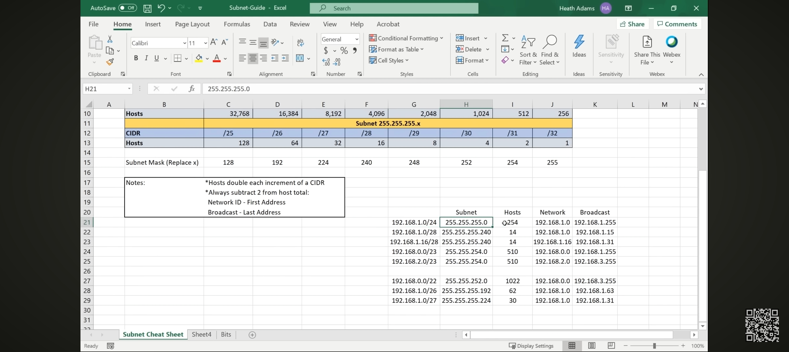

# Subnetting

Notes from PEH's subnetting section, using the "magic number" method.

## Resources
- [Seven Second Subnetting](https://www.youtube.com/watch?v=ZxAwQB8TZsM)
- [Magic Number Subnetting](https://youtu.be/P1ROXMLjL04) 
- [Website for subnetting](https://www.ipaddressguide.com/)
- [Subnet Guide Cheat Sheet](https://drive.google.com/file/d/1ETKH31-E7G-7ntEOlWGZcDZWuukmeHFe/view)

## The Magic Number Method
The "magic number" is `256 - subnet mask octet value` (in the interesting octet).
It tells you the block size — the interval between valid network addresses.

Example: `/26` → subnet mask `255.255.255.192`
- Magic number = `256 - 192 = 64`
- Networks increment by 64: `.0, .64, .128, .192`

## Quick Reference (Class C, /24-/32)
| CIDR | Subnet Mask | Magic Number | # Hosts (usable) |
|------|-------------|---------------|-------------------|
| /24  | 255.255.255.0     | 256        | 254 |
| /25  | 255.255.255.128   | 128        | 126 |
| /26  | 255.255.255.192   | 64         | 62  |
| /27  | 255.255.255.224   | 32         | 30  |
| /28  | 255.255.255.240   | 16         | 14  |
| /29  | 255.255.255.248   | 8          | 6   |
| /30  | 255.255.255.252   | 4          | 2   |

## Subnetting Example

## Worked Example

**Given:** `192.168.1.130/26` — find the network address, broadcast address, and usable host range.

**Step 1: Identify the magic number**
`/26` → subnet mask `255.255.255.192`
Interesting octet = last octet (192)
Magic number = `256 - 192 = 64`

**Step 2: Find the network blocks**
Blocks increment by 64 in the last octet: `0, 64, 128, 192`

**Step 3: Find which block 130 falls into**
`130` falls between `128` and `192` → so the network address is `192.168.1.128`

**Step 4: Find the broadcast address**
Next block starts at `192`, so broadcast = one below that = `192.168.1.191`

**Step 5: Find usable host range**
Usable range = network address + 1, to broadcast address − 1
→ `192.168.1.129` to `192.168.1.190`

**Answer:**
| Field | Value |
|---|---|
| Network Address | 192.168.1.128 |
| Broadcast Address | 192.168.1.191 |
| Usable Host Range | 192.168.1.129 – 192.168.1.190 |
| Total Usable Hosts | 62 |

## Alternate Method: Binary AND

Instead of the magic number shortcut, you can find the network ID directly using binary:

1. Convert the octet of interest (in both IP and mask) to binary
2. Line up the bits
3. Wherever the mask bit is `1`, keep the IP's bit
4. Wherever the mask bit is `0`, force the result to `0`
5. Convert the result back to decimal — that's the network address in that octet

This is a bitwise AND operation: `IP AND Mask = Network Address`

**Example (same as above): 192.168.1.130/26**

\`\`\`
IP:      130 = 1 0 0 0 0 0 1 0
Mask:    192 = 1 1 0 0 0 0 0 0
AND    ------------------------
Result:        1 0 0 0 0 0 0 0  = 128
\`\`\`

Network address = `192.168.1.128` — matches the magic number method above.

This is the "true" underlying method; magic number subnetting is a faster shortcut derived from this same logic, useful once you understand why it works.

## Why It Matters for Pentesting
Subnetting understanding is needed to correctly scope engagements (identifying in-scope IP ranges) and to reason about network segmentation during internal assessments.

